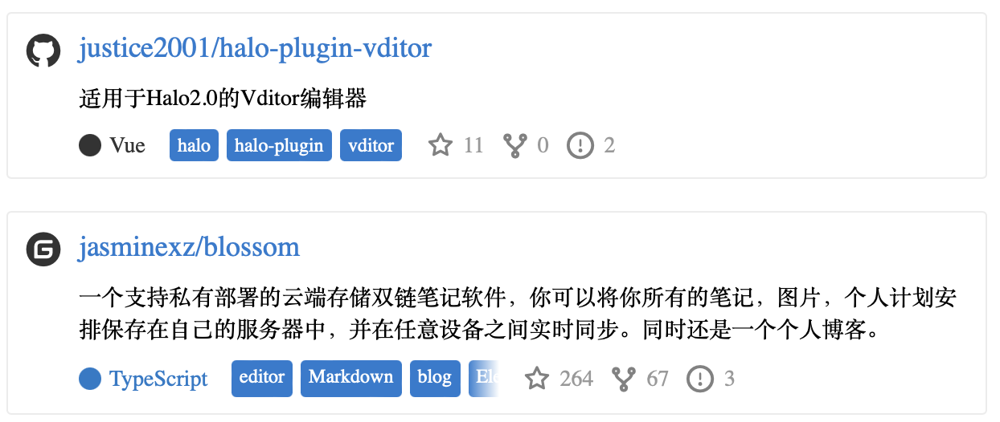

# Git组件



Git组件为用户提供了在页面中嵌入git仓库的解决方案，常用的使用场景是为开源项目开发者发布文章时可以将此Git仓库快速嵌入到文章之中。

当前git组件支持的平台包括

- `GitHub`: 无需配置URL
- `Gitee`: 无需配置URL

## 语法

```markdown
git:[<url>@<platform>/<owner>/<repository>]
```

### url

URL是平台的URL，当前为保留字段，为后续加入自建Gitlab和Gitea做支持准备。如果您使用的是官方的平台则无需填写此字段。

URL示例：`https://gitlab.example.com/`

### platform

标识平台类型，解析器会根据不同的平台选择不同的API和返回值处理方式。当前解析器支持下列平台：

- `Github`：仅支持官方平台
- `Gitee`：仅支持官方平台

### owner

仓库所有者

### repository

仓库名称

## 示例
- GitHub平台

    ```markdown
    git:[@github/justice2001/halo-plugin-vditor]
    ```
- Gitee平台

    ```markdown
    git:[@gitee/blossom-editor/blossom]
    ```

- Gitea平台（当前未实现）

  ```markdown
  git:[https://git.mczhengyi.top@gitea/zhengyi/halo-plugin-vidtor]
  ```
