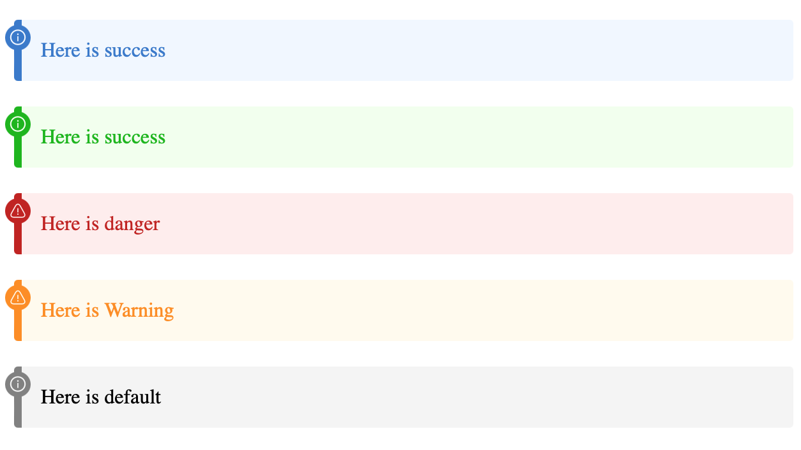

# Tips组件

<p align="center">

</p>

Tips为用户提供了多彩的提示组件，支持五种类型：`default`、`danger`、`success`、`warn`、`info`。

同时内容支持渲染HTML内容。

## 语法

```markdown
tips:<type>
<content>
```

## 示例

```markdown
tips:danger
This is a Danger type tips
```
